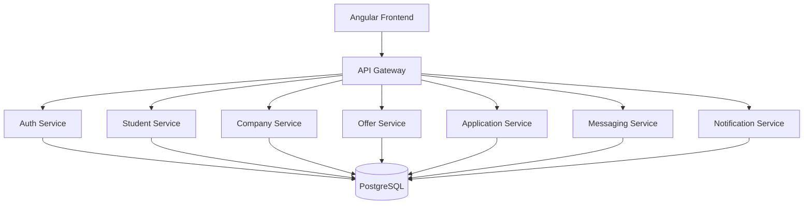

# InternLink Architecture (Week 1)

## High-level architecture

- Frontend: Angular (presentation layer).
- API Gateway: single entry point from frontend.
- Backend: NestJS microservices per bounded context.
- Database: PostgreSQL.
- Infrastructure: Docker Compose (local development baseline).

## Microservices

- API Gateway: routing, aggregation, auth guard orchestration (future week).
- Auth Service: register, login, JWT, refresh token, forgot password (week 2).
- Student Service: student profile and CV metadata.
- Company Service: company profile and validation state.
- Offer Service: internship offers CRUD and search filters.
- Application Service: application workflow lifecycle.
- Messaging Service: student-company conversations after application.
- Notification Service: emails and in-app notifications.

## Communication strategy

- Week 1 baseline uses HTTP between gateway and services.
- Event-driven messaging (RabbitMQ/Kafka) can be introduced from week 4+ for async flows.

## Initial routing map (gateway)

- /api/auth -> auth-service
- /api/students -> student-service
- /api/companies -> company-service
- /api/offers -> offer-service
- /api/applications -> application-service
- /api/messages -> messaging-service
- /api/notifications -> notification-service

## Diagram

## Week 1 non-functional baseline

- Containerized infrastructure for reproducible local setup.
- Shared env file model for all services.
- Health endpoints in each service for smoke checks.
- Initial DB schema with clear foreign key model.
